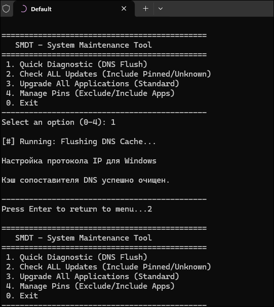

# 🛠 System Maintenance & Diagnostic Tool (SMDT)

A lightweight, modular utility for Windows system optimization, diagnostic reporting, and package management automation. 

[](https://www.python.org/downloads/)
[](LICENSE)
[](https://www.microsoft.com/windows)

## 📖 Overview
This tool automates routine system administration tasks, combining low-level network diagnostics with high-level software management via Winget integration.

## 🖼 Preview


## 🚀 Key Features
- **Interactive Menu:** Simple console interface for quick navigation.
- **Network Diagnostic:** Instant DNS cache flushing and Winsock reset.
- **Software Management:** Fully automated Winget updates and "pin" management to prevent unwanted version changes.
- **System Hygiene:** Analysis and cleanup of system logs and temporary directories.

## 🛠 Installation
1. Ensure you have Python 3.8+ installed.
2. Clone the repository:
```bash
git clone [https://github.com/Ralex999/Technical-Notes.git](https://github.com/Ralex999/Technical-Notes.git)
cd Technical-Notes
python maintenance.py
